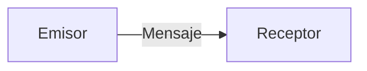

# La Comunicacion Moderna. 

Partamos del modelo coumunicacion clasico Emisor-Mensaje-Receptor. En primera instancia diremos que este modelo esta imcompleto
![[Pasted image 20260204190221.png]]
porque no considera que tambien hay un medio, momento y forma. Que pasa cuando tenemos a un Receptor que te entiende mejor de lo que tu te escuchas y que pasa cuando el mensaje se ha enviado de la mejor forma posible pero el recepto no lo ha entendido. Esto quiere decir que hay un buen receptor y un mal emisor. 

De aqui diremos que hay un buen emisor que sera aquel que distingue el tipo de couminicacion que empleara para transmitir un mensaje dependiendo de lo que quiere transmiter, es decir se comunica de forma estrategica, no improvisada. Los mejores emisores dintingen:
* Hechos de Opiniones
* Sentimos de Opiniones
* Consecuencias
* Acuerdos
* Justificaciones 
En general diremos que un buen emisor esta mas consciente de los elementos component la informacion y la estructura misma del lenguaje. 

Por ultimo diremos que un buen mensaje sera aquel que tenga:
* Finalidad.
* Lugar y Tiempo
* Monotematico
* Adaptacion a los Interlocutores.

Los mejores escuchas conectan con el ritmo, el estado y el contenido del mensaje.

### Ejericio: Se un Mejor Emisor. 
Practica por escrbir 7 mensajes que tengan tengan la estructura que hemos definido

## Modelo de Comunicacion Basico (Tradicional). 

La forma, el medio o el contexto son clave en nuestra comunicacion sin embargo como primer definicion de lo que es couminicacion diremos que esta se encuentra constituida de tres elementos: 

**¿Podemos mejoar como emiros?** o **¿Podemos mejorar como receptores?**. Diremos que si <b style="color:red">¿Porque? Las Justificacion general es que basicamente estamos llegando a un curso con un metodo o una forma de comunicarnos, y no necesariamente es la mejor, si queremos mejorar nuestra capacidad de comunicarnos para lograr un objetivo en comun, aprender un tema o generar un vinculo afectivo</b>

### Los mejores Emisores
Los mejores emisores son aquellos que distinguen el tipo de comunicacion que emplearan segun lo que quieren transmitir y lograr; es decir: **se comunican estrategicamente**, no improvisadamente (continuar con los sesgos). Los buenos emisores estan consicientes de los elementos (distingir hechos, opiones (creo, humildad), sentimientos, consecuencias, acuerdos, justificaciones) y la estructura misma del lenguaje (estar mas conciente de la manera en que ordeno las ideas) por ejemplo: 

* **Finalidad:** Diseñar un mensaje que tome en cuenta su proposito, que surja de una intencion clara de:
  * Generar vinculos afectivos.
  * Lograr un resultao
  * Aprende algo
  
* **Lugar y tiempo:** Al diseñar un mensaje y definir su proposito debemos de preguntarnos cual es el mejor contexto y momento para presentarlo.
  
* **Monotematico:** Tener una conversacion y cerrarla (hablar de una cosa a la vez) 
  
* **Adaptacion a los interlocutores:** Adaptar el mensaje para generar una misma pespectiva entendiendo la naturaleza de la comunicacion (cual es la naturaleza de emisor y cual es la naturaleza del receptor)

### Los mejores Receptores. 
Los mejores escuchas son aquellos que escuchan y conectan con el: 

* Ritmo
* Estado
* Contenido 
