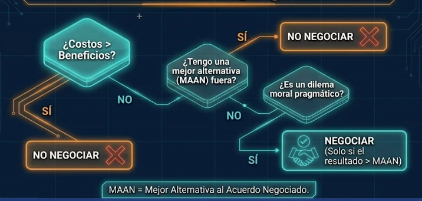

# Intuiciones Finales (No todo en la vida debe negociarse). 

## ¿Cuándo sí vale la pena entrar a una negociación?
Para ayudarnos a decidir cuando vale la pena negociar analizaremos una matriz de decisión para evaluar si realmente conviene hacerlo o si es mejor tomar otro camino.

El primer criterio consiste en comparar el costo de negociar con los beneficios esperados. Negociar implica tiempo, energía, dinero y preparación; si todo ese esfuerzo es mayor que el beneficio que podríamos obtener, entonces simplemente no vale la pena negociar. En ese caso aparece el concepto de MAN (Mejor Alternativa al Acuerdo Negociado), es decir, la opción que tenemos disponible si decidimos no negociar.

Incluso cuando el costo de negociar es razonable, debemos de preguntarnos si existe una alternativa mejor fuera de la negociación. Si hay una opción más conveniente que lo que podríamos lograr negociando, nuevamente la decisión inteligente es elegir esa alternativa. Solo cuando negociar puede producir un resultado mejor que cualquier otra opción disponible tiene sentido avanzar.

También plantea una distinción importante: si lo que está en juego no es un dilema práctico o concreto, sino simplemente el deseo de tener la razón o de entrar en discusiones abstractas, entonces tampoco vale la pena negociar. La negociación tiene sentido cuando existe un objetivo real que se quiere lograr.

## Resumen ejecutivo

**El liderazgo es lograr que las cosas sucedan a travez de acuerdo sostenibles**

Negociar es una habilidad esencial para la vida y el liderazgo, es importe de distinguir entre posición e interés, utilizar conscientemente las tres palancas de influencia (información, tiempo y poder), y prepararse antes de cualquier conversación importante.

Entre las acciones prácticas que propone están diagnosticar si estamos frente a un problema o un conflicto, definir nuestra mejor alternativa al acuerdo negociado y preparar preguntas que nos permitan comprender mejor a la otra parte antes de presentar propuestas.

En toda negociación siempre están en juego dos cosas al mismo tiempo. Por un lado, el resultado concreto que queremos lograr; por otro, la calidad de la relación con la otra persona. Un buen negociador busca cuidar ambas dimensiones, logrando acuerdos que produzcan resultados y al mismo tiempo fortalezcan las relaciones para el futuro.

## Reflexion

* ¿Realmente vale la pena negociar esta situación o tengo una mejor alternativa fuera de la negociación?

* ¿Estoy cuidando solo el resultado o también la calidad de la relación con la otra parte?

* ¿Cómo puedo prepararme mejor antes de mi próxima negociación para aumentar mi capacidad de influencia?